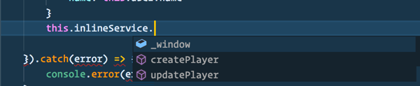

#  Inline Manual Angular Integration

  

This is a simple example of how [Inline Manual](https://inlinemanual.com) may be integrated within an Angular application. It doesn't serve as a complete solution but simply demonstrates how useful it would be to have interfaces available for the inline object on `Window`.

  

Such as having IntelliSense available.

  

**Usage**

    import { Component, AfterViewInit }  from  '@angular/core';
    import { InlineService }  from  'services/inline-manual.service';
    constructor (private inlineService: InlineService) {}
    
    ngAfterViewInit()  {
	 this.inlineService.showPanel();
    }
or

    this.trackingData = {
      uid: this.User.id,
      email: this.User.email,
      username: this.User.username
      };
    this.inlineService.createPlayer(this.trackingData);

**Navigation / Router changes**
We don't want to perform refreshes / re-directs in the normal sense so we can detect the changes of route by adding `(activate)="changeOfRoutes($event)"` to the `<router-outlet>` which is most probably on `app.component.html`. Then within `app.component.ts` we can do

    changeOfRoutes(event)  {
      this.inlineService.updatePlayer();
    }

**Notes**
Example 1 is called in `ngAFterInit` to ensure that the `<script>` has been loaded from the remote source. Calling functions on `_window` before this will give undefined errors. 

Example 2 Shows you you would call the service with an object to start tracking. 